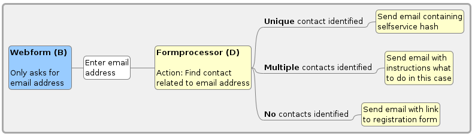

# de.systopia.selfservice

## Introduction

With this extension you can give constituents access to their CiviCRM data without them needing a Drupal account.

This extension has been created with the following use case in mind:
Let people read and change their contact data in a drupal webform. To access the data, people need to enter their email address. A link to the prefilled
webform will be sent to that email address if and only if the email address exists within CiviCRM.

## We need your support

This CiviCRM extension is provided as Free and Open Source Software, and we are happy if you find it useful. However, we have put a lot of work into it (and continue to do so), much of it unpaid for. So if you benefit from our software, please consider making a financial contribution so we can continue to maintain and develop it further.

If you are willing to support us in developing this CiviCRM extension, please send an email to info@systopia.de to get an invoice or agree a different payment method. Thank you!

## Documentation

The documentation for this extension can be found [here](https://docs.civicrm.org/selfservice/en/latest/).

This is a scheme to demonstrate the workflow of the extension. It is explained in more detail in the documentation.

_Blue: Drupal level, Yellow: CiviCRM level, White: Manual interaction_
