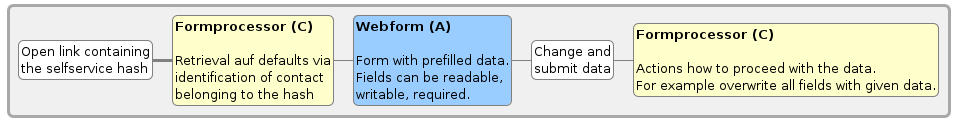
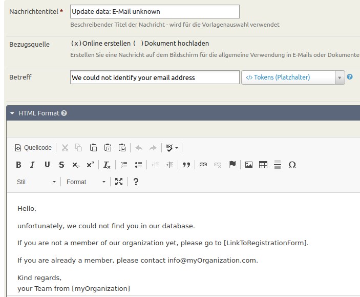
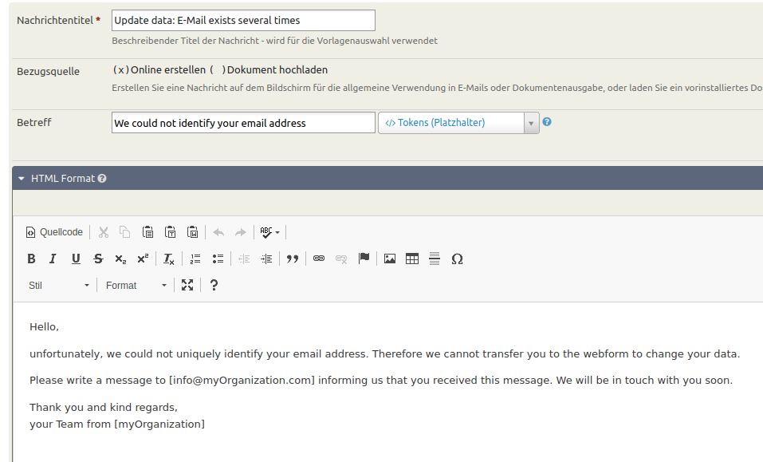
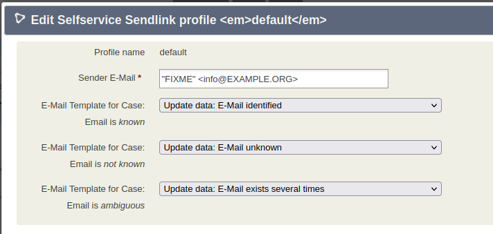
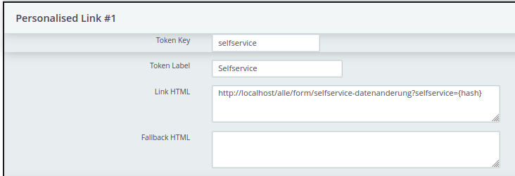
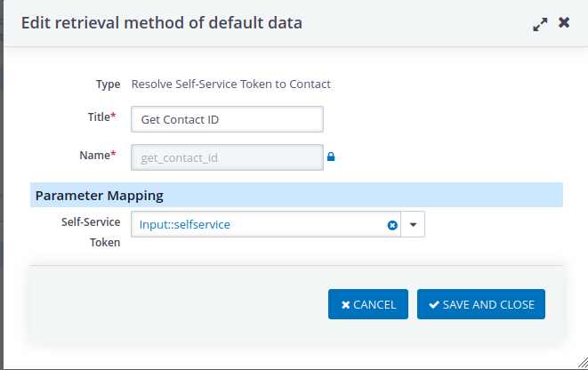
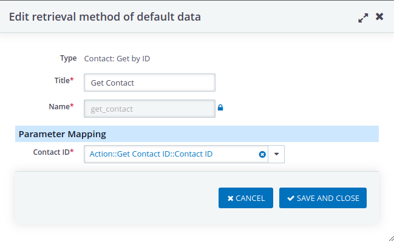

# Use Case

This extension is best described in a use case. Suppose your organization has members and you want to allow your members to get access to their personal data via an online formular. Your members shall be able to see and update some of the data that is stored in CiviCRM in their corresponding contact, i.e. their name, address and membership status.

However, you don't want to create an account in Drupal and/or CiviCRM for every member of your organization. This is where the selfservice extension comes into play.

## Components

To configure this setup, you need the following components:

- (A) A Drupal Webform which serves as online formular to show / update contact information
- (B) A Drupal Webform which asks only for the email-address where the selfservice email should be sent to
- (C) A formprocessor that interacts with the webform (A)
- (D) A formprocessor that interacts with the webform (B)
- (E) The Drupal module CMRF to make the interaction between formprocessors and drupal webform possible

!!! note
    The Drupal instance containing the webform doesn't need to be identical to the Drupal instance containing CiviCRM. If your CiviCRM is protected via VPN, you can use CiviRemote to allow communication between the webform (which would be on a publicy available Drupal instance) and CiviCRM.

This is a scheme to demonstrate the workflow of the extension:



_Blue: Drupal level, Yellow: CiviCRM level, White: Manual interaction_

## User experience

If everything is configured as described below, a member of your organization would proceed as follows:

They would go to your website to change their data and be directed to webform (B). After entering their email-address, they would get an email describing the next steps.

- If the email address can not be found in CiviCRM, they will get a message telling them that what to do in this case. For example, this message could contain an explanation how to become a member of your organization or contain a link to a registration form. They will not be able to view / update any data.
- If there exist several contacts with this email address in CiviCRM, they will get a message telling them what to do in this case. For example write an email to _info@myOrganisatizon_ because there is an unforseen problem with this email address. They will not be able to view / update any data of any found contact.
- If there exists a unique contact with this email address in CiviCRM, the message contains a link, for example [https://myPublicDrupalInstance/webformA?selfservicetoken=31_907c4cba9129a85d35d327a8ca66ae8e_1695130674_168]().

The link in the email contains a token which is created by the selfservice extension and cannot be guessed by external parties.

Clicking the links opens webform (A) which is prefilled with the data of the corresponding contact in CiviCRM. If the webform is configured accordingly, your member can not only view the existing data but also change the data. Submitting the form will send the data to CiviCRM. You can configure in formprocessor (C) what exactly should happen with the submitted data and if someone of your organization should be informed about the change.

## Configurations

### Message templates

Configure message template for the emails that will be sent to the member of your organisation in case their email address can be identified or not.

This could be an example for the message template that is sent if the contact can be uniquely identified:


The token `{PersonalisedLink.link_webformA}` does not exist yet and will be configured in the next step.

This could be an example for the message template that is sent if no contact exists in CiviCRM:



and this is an example for the message templet if the email address exists for different contacts:




### Selfservice extension

Go to `civicrm/admin/selfservice` and define a new profile or configure the default profile.

If you plan to use the selfservice extension for several webforms (for example a form to change membership data for individuals and a different form to change membership data for organizations) you should configure different profiles for each of them.

In the profiles you define which messages should be sent in the case that

* there exists a unique contact with this email address
* the email address can not be found in CiviCRM
* there exist several contacts with this email address in CiviCRM



Additionaly you need to define the token which is used in the message template for the first case. It is defined under **Personalised Link #1** and looks for example like this:



The value of `{hash}` will be replaced by the selfserive extension and is unique for every contact.

For every webform you need to define a different personalised link.

### Formprocessor (C)

The formprocessor should include all fields that you plan to show in Webform (A). In our example, these are fields for the name, address and membership status.

Additionally, you should open the tab **Retrieval of defaults**, enable it and enter a retrieval criterium  `selfservice`, where the generated token of the selfservice extension can be entered.


In the section **Retrieval methods of default data**, you need to first get the Contact ID out of the selfservice token:



You might add further retrieval methods. If you want to get contact data and membership data, you need to get the contact and membership:



Now, you are ready to configure the defaults in the last section.

### Formprocessor (D)


### CiviMRF

In the Drupal instance of your webform, you need to install and configure the CiviMRF extension. A documentation including a helpful [use case](https://docs.civicrm.org/formprocessor/en/latest/sign-up-newsletter) can be found [here](https://docs.civicrm.org/formprocessor/en/latest/).

In short, you have to go through the following steps

- Make a Backup of your Drupal instance
- Install the Drupal Webform module
- Install the [CiviMRF Core module](https://github.com/CiviMRF/cmrf_core)
- Enable the modules **CiviMRF Core**, **CiviMRF Call Report**, **CiviMRF Webform** and **CMRF Form Processor** at `admin/modules`
- Define an API Key
  - Create a new role **API user** in Drupal with the additonal permissions **CiviCRM: Zugriff auf CiviCRM-Backend und -API** and all permissions related to the selfservice extension
  - Create a new user **API user** in Drupal and assign the **API user** role
  - [Assign an API key](https://docs.civicrm.org/sysadmin/en/latest/setup/api-keys/) to the **API user**
- Define a profile at `admin/config/cmrf/profiles`
  - The [Site Key](https://docs.civicrm.org/sysadmin/en/latest/setup/secret-keys/) can be found in your `civicrm.settings.php`
  - The URL is something of the form `https://myCiviCRMWebsite/civicrm/ajax/rest`
  - Insert the API Key you just created.
- Define connectors for formprocessor (C) and formprocessor (D) at `admin/config/cmrf/connectors`

### Webform (B)

Create a new Webform in Drupal. At **Settings → Emails/Handlers** add a handler **CMFR Form Processor**. Choose **FormProcessor** as the Connector and  **Formprocessor (D)** from the Form Processor dropdown list. Under **Advanced** click on **Enable the CMFR Form Processor handler**. The email address field you defined in Formprocessor (D) should be available for selection. After being selected, the field is  available in your form. Change the layout of the form to your liking.

### Webform (A)

Proceed similarly as for Webform (B):

Create a new Webform in Drupal. At **Settings → Emails/Handlers** add a handler **CMFR Form Processor**. Choose **FormProcessor** as the Connector and  **Formprocessor (C)** from the Form Processor dropdown list. Under **Advanced** click on **Enable the CMFR Form Processor handler**. All fields you defined in Formprocessor (C) should be available for selection. They are then available in your form and you can change the layout of the form to your liking.

Additionally, go to the end of the **Advanced** tab of the handler. There you can find a section **Parameters**. From the dropdown options for **selfservice** you should choose **Url**.

### Optional: CiviProxy

These configurations are only necessary, if your CiviCRM is behind a VPN and you have a separate proxy server which is configured as described in the [CiviProxy Documentation](https://docs.civicrm.org/civiproxy/en/latest/).

On the proxy server, you have to adapt the configuration file  `config.php` to allow for formprocessor API actions. This could be an example:
```php
$rest_allowed_actions = [
  'all' => [
    'Contact' => [
      'getsingle' => [
        'email' => 'string',
      ],
    ],
    'RemoteContact' => [
      '*' => [
        '*' => 'string',
      ],
    ],
    'FormProcessor' => [
      '*' => [
        '*' => 'string',
      ],
      'getfields' => [
        '*' => 'string',
      ],
      'formprocessor_A' => [
        '*' => 'string',
      ],
      'formprocessor_B' => [
        '*' => 'string',
      ],
    ],
    'FormProcessorDefaults' => [
      'getfields' => [
        '*' => 'string',
      ],
      'formprocessor_A' => [
        '*' => 'string',
      ],
    ],
    'FormProcessorInstance' => [
      'list' => [
        '*' => 'string',
      ],
    ],
  ],
];
```
*TODO: I don't know if this is a minimal example, for example if Contact and RemoteContact actions really are necessary.*

## Test your Configuration

There are several intermediate steps permitting you to test your configuration.

After having created the form processors, you can try them out within CiviCRM without needing to configure CiviMRF or creating the webforms. Go to **Administer → Automation → Form processors**. Next to every form processor, you can click on **try out**.

If you try out Formprocessor (D), an email should be sent. If you have configured the outbound mail of your system to write into the database, you will find the email under **Mailings → Archived Mailings**. Choose **Public View** to see the link for Webform (A) including the selfservice hash.

To try out Formprocessor (C), you need to know the selfservice hash. If you haven't configured Formprocessor (D) yet, you can find the selfservice hash with APIv3 - choose **Selfserive** as entity and **get_action** as action.

If the formprocessor works but you have trouble with the webform, it can be helpful to look at the CiviMRF calls at `admin/reports/cmrfcalls`.
